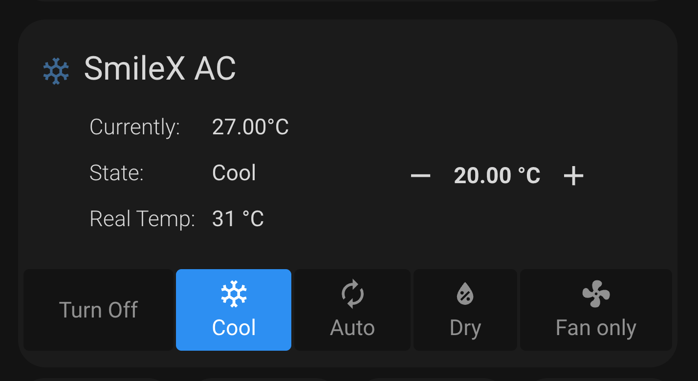

# Simple Thermostat

[](https://github.com/hacs/integration)
[](https://github.com/smilexth/simple-thermostat/releases)
[](LICENSE)

A clean, compact thermostat card for Home Assistant Lovelace UI. Provides simpler interactions, takes up less space, and offers modular configuration for sensors, modes, and theming.

> Based on the original work by [nervetattoo](https://github.com/nervetattoo/simple-thermostat). This fork is independently maintained with modern Home Assistant support.



## Features

- Compact, space-efficient thermostat display
- Full HVAC, fan, preset, and swing mode controls
- Configurable sensor display (temperature, humidity, energy, etc.)
- Template-based sensors with Squirrelly engine
- CSS custom properties for full theme control
- Built with Lit 3 for modern performance
- Compatible with Home Assistant 2024.1+

## Compact Mode

Hide everything but sensors and temperature control:

```yaml
type: custom:simple-thermostat
entity: climate.hvac
layout:
  step: row
header: false
control: false
```

## Installation

### HACS (Recommended)

1. Open **HACS** → **Frontend**
2. Click the three-dot menu → **Custom repositories**
3. Add `smilexth/simple-thermostat` with category **Plugin**
4. Install **Simple Thermostat**
5. Add to your Lovelace resources:
   ```yaml
   url: /hacsfiles/simple-thermostat/simple-thermostat.js
   type: module
   ```

### Manual

1. Download `simple-thermostat.js` from the [latest release](https://github.com/smilexth/simple-thermostat/releases/latest)
2. Place it in your `config/www/` folder
3. Add to Lovelace resources:
   ```yaml
   resources:
     - url: /local/simple-thermostat.js?v=1
       type: module
   ```

## Configuration

### Basic

```yaml
type: custom:simple-thermostat
entity: climate.my_room
```

### Full Example

```yaml
type: custom:simple-thermostat
entity: climate.my_room
step_size: 1
decimals: 1
sensors:
  - entity: sensor.room_humidity
    name: Humidity
  - entity: sensor.room_energy
    name: Energy today
  - attribute: min_temp
    name: Min temp
header:
  name: Living Room
  icon: mdi:sofa
  toggle:
    entity: switch.pump_relay
    name: Pump
  faults:
    - entity: binary_sensor.communications_fault
    - entity: binary_sensor.low_battery_fault
      icon: mdi:battery-low
control:
  hvac:
    "off":
      name: Turn Off
    cool: true
    heat: true
  preset:
    away: true
    none:
      name: Home
```

### Options Reference

| Option | Type | Default | Description |
|--------|------|---------|-------------|
| `entity` | string | **required** | Climate entity ID |
| `header` | object\|false | auto | Header configuration (see below) |
| `setpoints` | object\|false | auto | Temperature setpoint configuration |
| `control` | object\|array\|false | `[hvac, preset]` | Mode control configuration |
| `sensors` | array\|false | `[]` | Additional sensor entities to display |
| `step_size` | number | `0.5` | Temperature increment/decrement step |
| `decimals` | number | `1` | Decimal places for temperature display |
| `unit` | string\|false | auto | Override temperature unit, or `false` to hide |
| `fallback` | string | `N/A` | Text when no valid setpoint is available |
| `label` | object | | Override labels (`temperature`, `state`) |
| `hide` | object | | Hide fields (`temperature: true`, `state: true`) |
| `layout` | object | | Layout options (see below) |
| `service` | object | | Override service call (`domain`, `service`, `data`) |

### Header

```yaml
header:
  name: Custom Name
  icon: mdi:thermostat
  toggle:
    entity: switch.my_switch
    name: true  # show friendly_name
  faults:
    - entity: binary_sensor.fault
      icon: mdi:alert
      hide_inactive: true
```

The `icon` option accepts a string or an object to map different icons per `hvac_action` or state:

```yaml
header:
  icon:
    cooling: mdi:snowflake
    heating: mdi:radiator
    idle: mdi:radiator-disabled
    "off": mdi:radiator-off
```

### Setpoints

For dual-zone thermostats, you can show/hide individual setpoints:

```yaml
setpoints:
  target_temp_low:
    hide: true
  target_temp_high:
```

### Mode Control

Simple array format:

```yaml
control:
  - hvac
  - preset
  - fan
```

Object format for fine-grained control:

```yaml
control:
  hvac:
    "off": true
    cool: true
    heat:
      name: Heating
      icon: mdi:fire
  preset:
    away: true
    none:
      name: Home
```

> **Note:** Always quote `"off"` and `"on"` mode keys in YAML.

### Layout

```yaml
layout:
  step: row          # row or column
  mode:
    names: true      # show mode names
    icons: true      # show mode icons
    headings: true   # show mode headings
  sensors:
    type: list       # list or table
    labels: true     # show sensor labels
```

## CSS Variables

Customize the card appearance using CSS custom properties:

| Variable | Default | Description |
|----------|---------|-------------|
| `--st-font-size-xl` | display3 font size | Target temperature |
| `--st-font-size-m` | title font size | Temperature unit |
| `--st-font-size-title` | 24px | Card heading |
| `--st-font-size-sensors` | subhead font size | Sensor text |
| `--st-spacing` | 4px | Base spacing unit |
| `--st-mode-active-background` | primary-color | Active mode button background |
| `--st-mode-active-color` | text-primary-color | Active mode button text |
| `--st-mode-background` | #dff4fd | Inactive mode button background |
| `--st-toggle-label-color` | text-primary-color | Toggle label text |
| `--st-font-size-toggle-label` | subhead font size | Toggle label size |
| `--st-fault-inactive-color` | secondary-background-color | Inactive fault icon |
| `--st-fault-active-color` | accent-color | Active fault icon |

### Theme Example

```yaml
simple-thermostat-theme:
  st-font-size-xl: 24px
  st-font-size-m: 20px
  st-font-size-title: 20px
  st-font-size-sensors: 30px
  st-spacing: 2px
```

### Card-mod Example

```yaml
type: custom:simple-thermostat
entity: climate.my_room
style: |
  ha-card {
    --st-font-size-xl: 24px;
    --st-font-size-m: 20px;
    --st-spacing: 2px;
  }
```

## License

MIT
